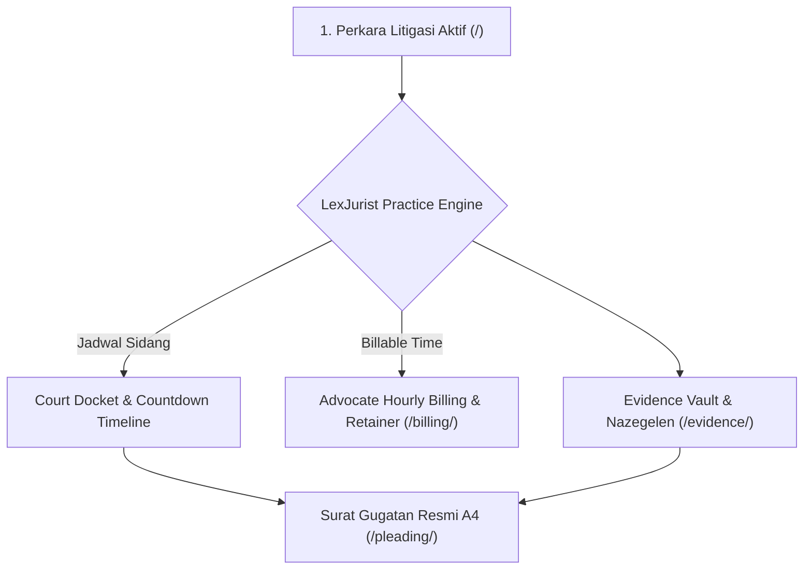

# ⚖️ LexJurist OS — Enterprise Law Practice ERP & Court Hearing Docket
### Titan #14 of the 50 Sovereign Enterprise Fleet (`olyxmintabansos-byte`)

---

## 💎 Overview
**LexJurist OS** adalah platform sistem operasi kantor hukum (*Law Practice Management ERP*) dan panitera digital perkara litigasi komersial berstandar peradilan Indonesia dan arbitrase internasional (BANI). Platform ini mengintegrasikan **Kalender Jadwal Sidang (Court Hearing Docket)**, **Buku Besar Honorarium Jam Kerja Advokat & Rekening Escrow Retainer Klien**, **Generator Surat Gugatan Perdata Resmi Berformat Cetak A4**, serta **Bilik Penyimpanan Alat Bukti (Legal Evidence Vault & Chain of Custody)**.

---

## 🚀 Fitur Unggulan (4 Rute 100% Live)

1. **Court Hearing Docket & Litigation Command (`/`)**:
   - Direktori perkara litigasi aktif: sengketa komersial, arbitrase BANI, dan sengketa HAKI.
   - Kalender jadwal sidang real-time dengan countdown agenda cito dan alokasi majelis hakim peradilan.
2. **Advocate Billable Hours & Retainer Trust Ledger (`/billing/`)**:
   - Time-sheet tracking jam kerja advokat berbasis tarif bertingkat (Senior Managing Partner hingga Junior Associate).
   - Pengawasan saldo rekening escrow retainer trust account klien dengan indikator utilisasi.
3. **Official Court Legal Pleading Generator (`/pleading/`)**:
   - Format surat gugatan perdata berstandar Mahkamah Agung RI siap cetak kertas A4 (`window.print()`).
   - Struktur resmi lengkap: Posita (fundamentum petendi), Petitum, sita jaminan (*conservatoir beslag*), dan uang paksa (*dwangsom*).
4. **Legal Evidence Vault & Chain of Custody (`/evidence/`)**:
   - Registrasi alat bukti perkara Pasal 1866 KUHPerdata: Akta Otentik Notariil, Akta Bawah Tangan, dan Bukti Elektronik.
   - Verifikasi legalisasi bea materai pos (*nazegelen*) dan pencatatan advokat penyimpan bukti.

---

## 🏗️ Diagram Arsitektur Sistem

---

## 🌐 Rute Live Produksi
- **Perkara & Sidang:** [https://olyxmintabansos-byte.github.io/lexjurist-os/](https://olyxmintabansos-byte.github.io/lexjurist-os/)
- **Billing & Retainer:** [https://olyxmintabansos-byte.github.io/lexjurist-os/billing/](https://olyxmintabansos-byte.github.io/lexjurist-os/billing/)
- **Surat Gugatan A4:** [https://olyxmintabansos-byte.github.io/lexjurist-os/pleading/](https://olyxmintabansos-byte.github.io/lexjurist-os/pleading/)
- **Evidence Vault:** [https://olyxmintabansos-byte.github.io/lexjurist-os/evidence/](https://olyxmintabansos-byte.github.io/lexjurist-os/evidence/)

---

*Architected by Antigravity Chief Systems Architect • Executed by Hermes Agent Desktop • Sovereign Fleet for `olyxmintabansos-byte`*
